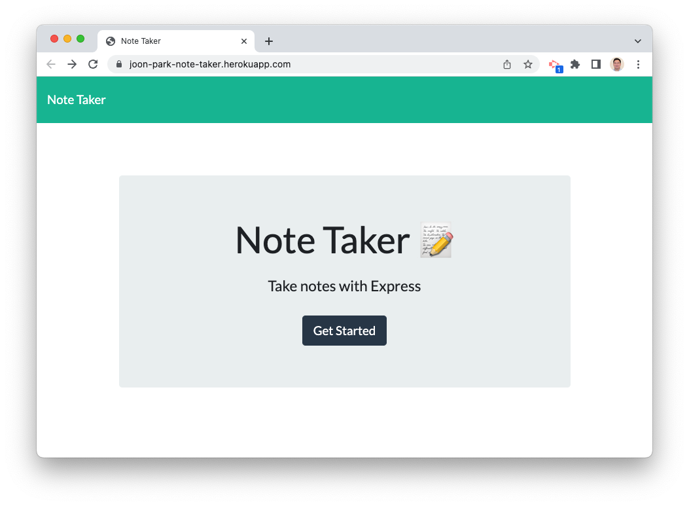
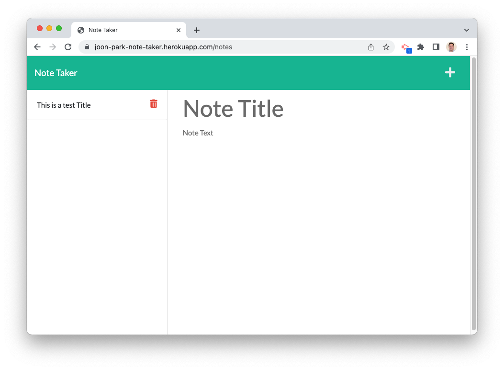
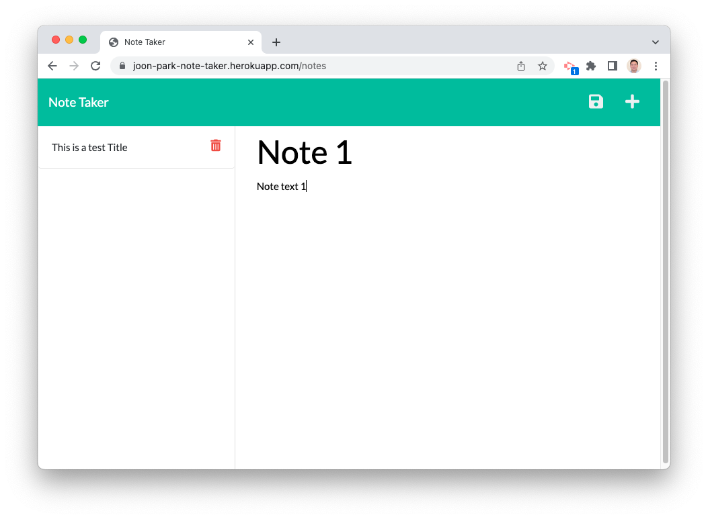
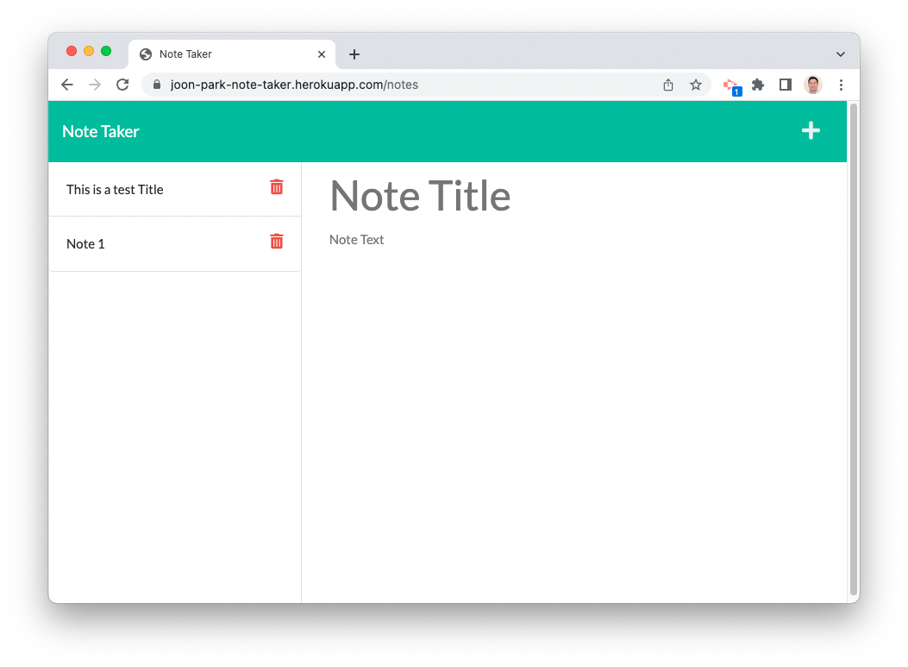
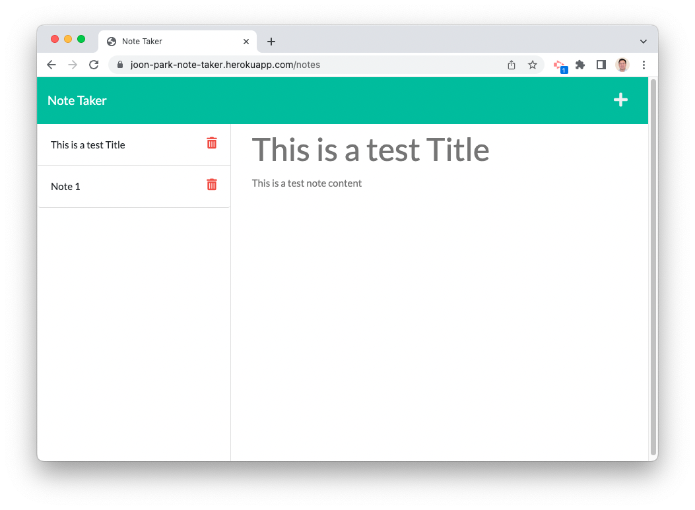
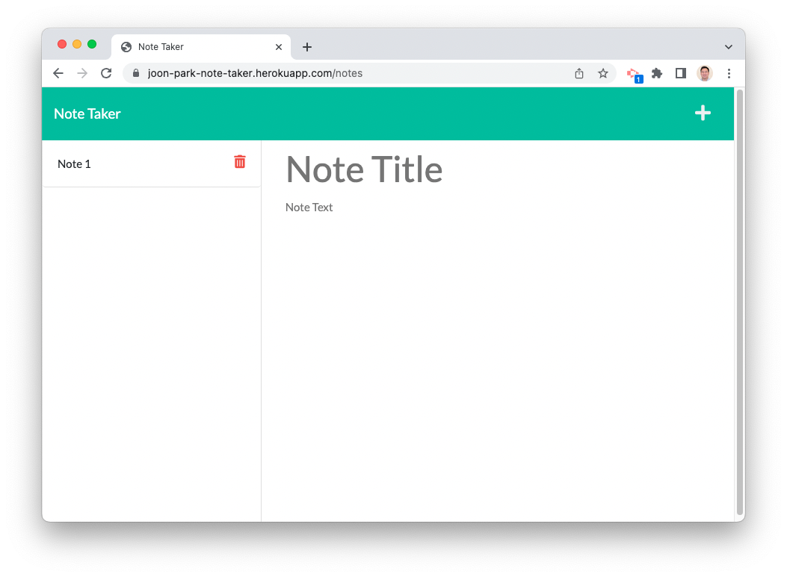

# Note-Taker

## Description

A web-based application that stores a list of notes created and edited by the user.

## Usage

The application can be accessed at:

[Note Taker](https://joon-park-note-taker.herokuapp.com/)

Click on "Get Started" to go to the notes page.

In the fields titled "Note Title" and "Note Text", enter the title and text of the note you wish to write. Then click on the Save icon in the top right corner to save the note.

To view a note that was previously saved, click on the note title on the left side.

To add additional notes, click on the Plus icon in the top right corner.

To delete notes, click on the Delete/Trash can icon next to the note you wish to delete.

## GitHub Repo

The GitHub repo for this project can be accessed at:

[GitHub](https://github.com/jsp220/Note-Taker)

## License

Licensed under the MIT license.